# Xom Arcade Analytics Platform

[English](README.md) | [Tiếng Việt](README.vi.md)

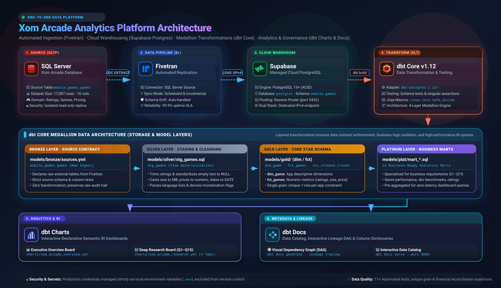

End-to-end ELT modern data stack project for the Xom Arcade mobile game catalog:

1. **Source**: Xom Dataset Microsoft SQL Server is the production OLTP source.
2. **Replication**: Fivetran replicates `mobile_games.games` into Supabase PostgreSQL.
3. **Transformation**: dbt Core cleans the raw data and builds conformed dimensional models and analytical marts for genre, developer, and release-trend reporting following the **Medallion Architecture** (Bronze &rarr; Silver &rarr; Gold &rarr; Platinum).
4. **Analytics & BI**: dbt Charts powers interactive semantic dashboards answering stakeholder requirements (Q1 through Q15).
5. **Governance**: dbt Docs generates interactive data catalogs and lineage graphs.

## Repository Structure

| Directory | Purpose & Documentation |
| :--- | :--- |
| [`models/`](models/README.md) | Medallion architecture transformation layers: |
| &emsp;├─ [`bronze/`](models/bronze/README.md) | Source table declarations and schema contracts (`sources.yml`). |
| &emsp;├─ [`silver/`](models/silver/README.md) | Staging layer cleaning, casting, and feature extraction (`stg_games.sql`). |
| &emsp;├─ [`gold/`](models/gold/README.md) | Dimensional star-schema: `dim_game`, `fct_games`, and `int_release_trends`. |
| &emsp;└─ [`plat/`](models/plat/README.md) | 14 curated analytical marts answering business questions Q1&ndash;Q15. |
| [`charts/`](charts/README.md) | dbt Charts configuration and dashboard definitions (`overview` & `research`). |
| [`scripts/`](scripts/README.md) | Database provisioning scripts (`supabase_fivetran_setup.sql`) and setup runbooks. |
| [`images/`](images/README.md) | Architecture vector graphics and verification walkthrough screenshots. |
| [`macros/`](macros/README.md) | Modular Jinja helpers: `clean_text`, `count_delimited_values`, `safe_divide`. |
| [`tests/`](tests/README.md) | Automated data quality suite: schema tests & 8 custom singular assertions. |
| [`analyses/`](analyses/README.md) | Ad-hoc analytical SQL queries compiled by dbt. |
| [`seeds/`](seeds/README.md) | Static, version-controlled reference CSV files. |
| [`snapshots/`](snapshots/README.md) | Type-2 Slowly Changing Dimension (SCD) definitions. |

## Prerequisites

- Python 3.10+
- `uv` for fast Python and CLI tool management
- Configured Fivetran connector and Supabase PostgreSQL project

## Local Setup

1. Create the virtual environment and install dependencies:

```sh
uv python install 3.12
uv venv --python 3.12 .venv
uv pip install --python .venv/bin/python dbt-postgres
uv tool install dbt-charts
```

2. Copy `.env.example` to `.env` and fill in credentials. A local `.env` is ignored by Git.
3. Run `scripts/supabase_fivetran_setup.sql` while connected to the default Supabase `postgres` database.
4. Configure Fivetran using `scripts/fivetran_source_setup.md`.
5. After the initial Fivetran sync, build and test all models:

```sh
set -a
. ./.env
set +a
DBT_PROFILES_DIR="$PWD" dbt debug
DBT_PROFILES_DIR="$PWD" dbt build
```

## Visual Walkthrough

### 1. Configure the Source

The source is the Xom Dataset Microsoft SQL Server database replicating `mobile_games.games`.

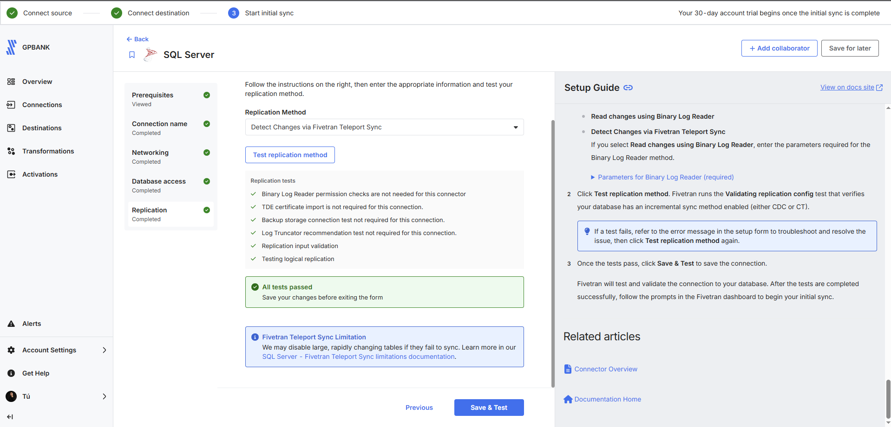

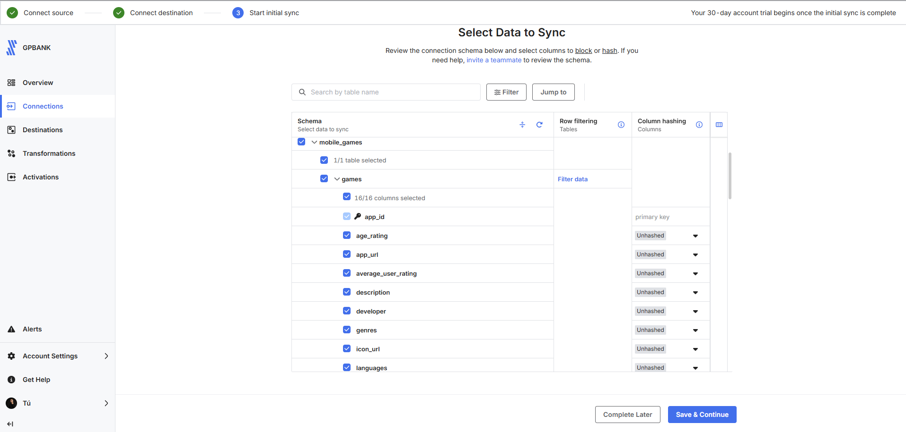

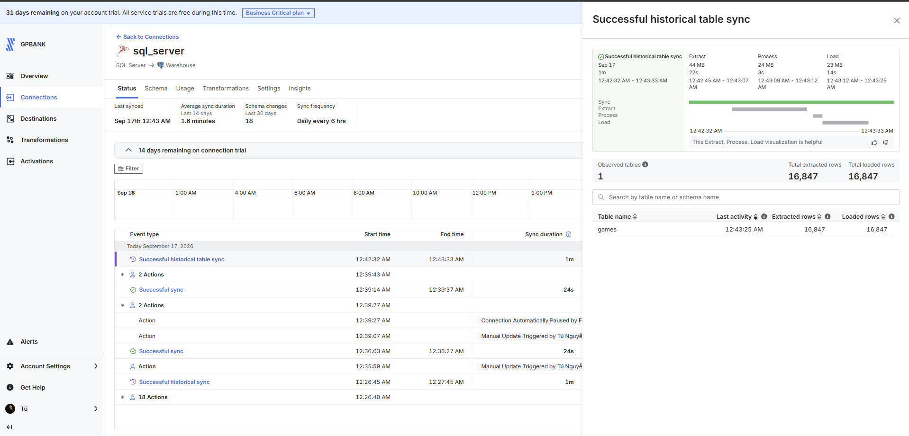

### 2. Configure the Destination

Fivetran writes to the Supabase `postgres` database under the `mobile_games` schema using the IPv4-compatible Session Pooler connection.

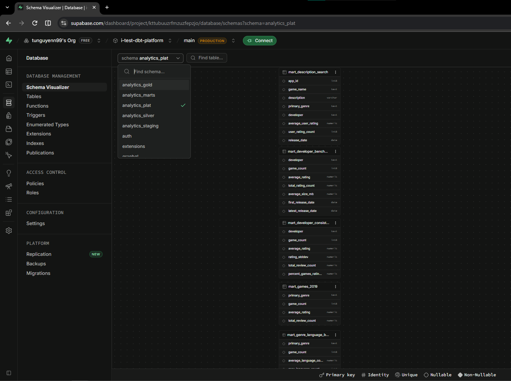

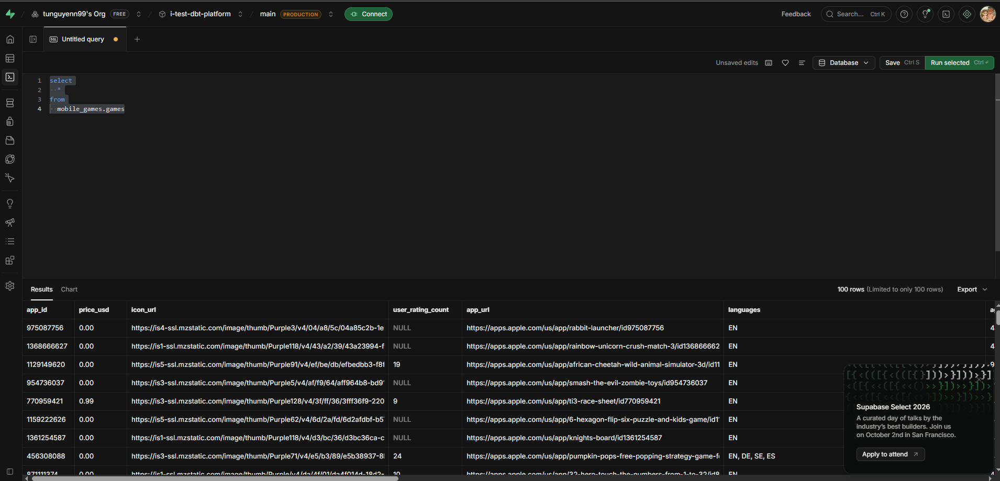

### 3. Explore dbt Charts

The platform includes an Executive Overview and a 4-tab Research Board (Executive, Market & Portfolio, Quality & Trends, Search & Discovery).

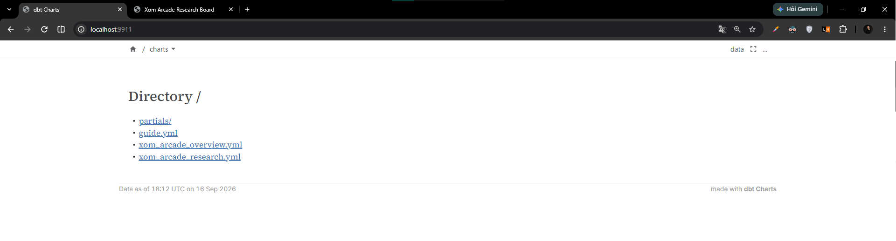

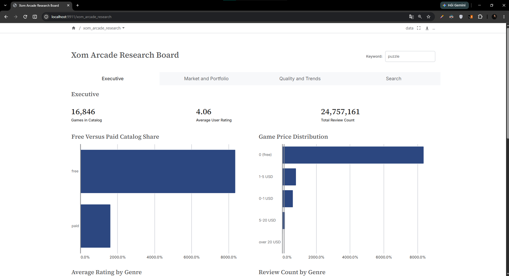

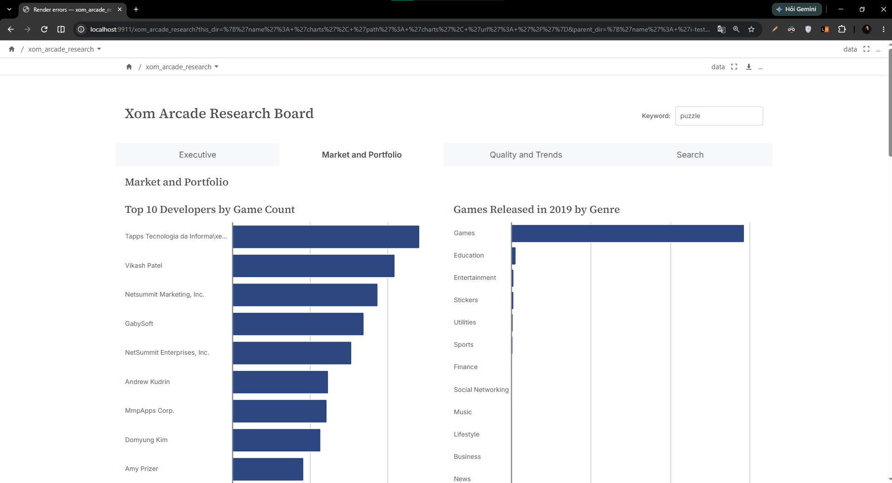

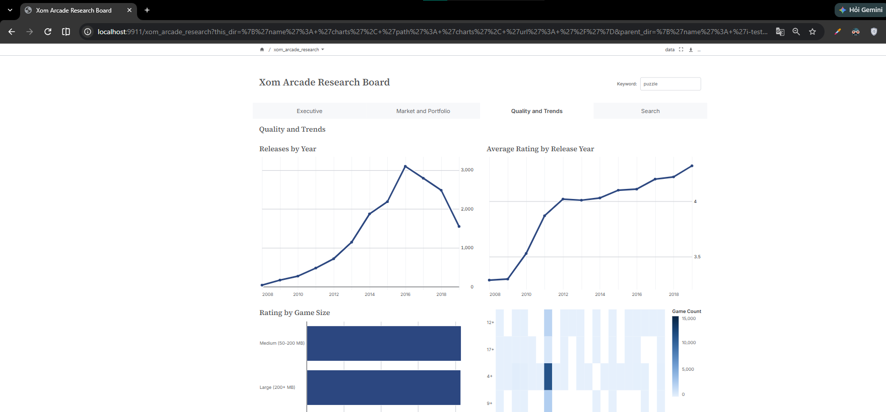

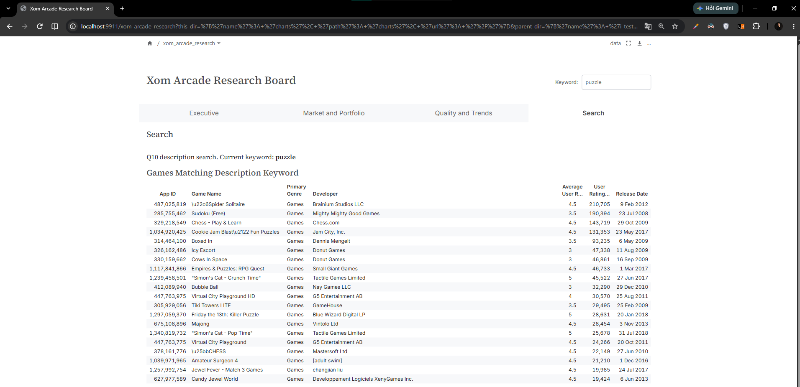

### 4. Generate dbt Docs

Generate and serve the interactive data catalog and lineage graph:

```sh
DBT_PROFILES_DIR="$PWD" dbt docs generate
DBT_PROFILES_DIR="$PWD" dbt docs serve --port 8080
```

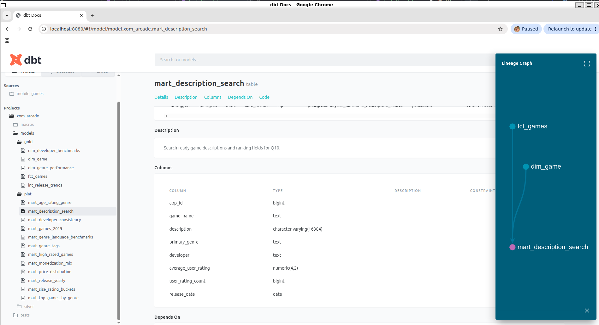

## dbt Charts Usage

Initialize and preview dashboards locally:

```sh
dct validate charts/
set -a
. ./.env
set +a
DBT_PROFILES_DIR="$PWD" dct render charts/xom_arcade_overview.yml --format terminal
dct serve
```

Access the live board preview in your browser at `http://localhost:3000`.

## Testing & Data Integrity

Run the automated test suite covering primary key uniqueness, metric domain ranges, and reconciliation balances:

```sh
set -a
. ./.env
set +a
DBT_PROFILES_DIR="$PWD" dbt test
```
